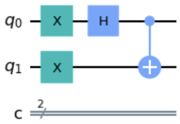
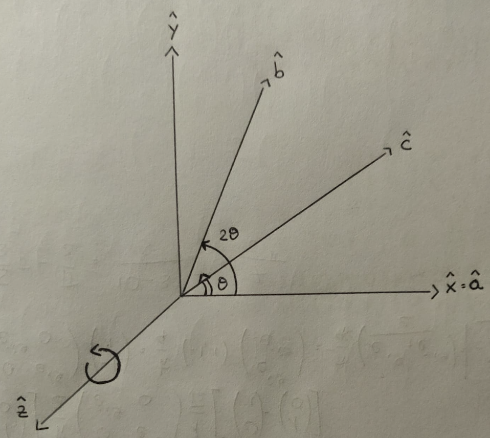
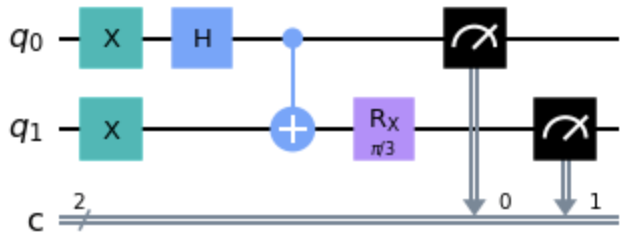
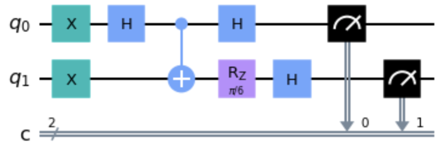
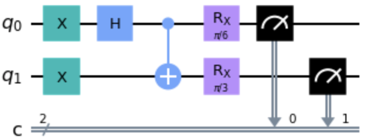
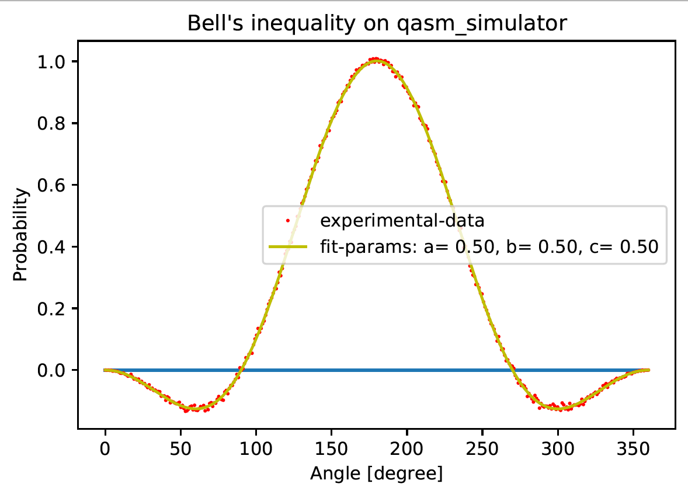
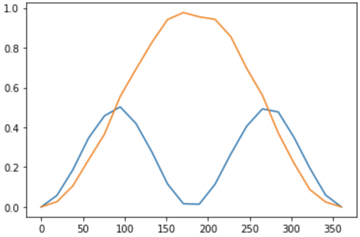
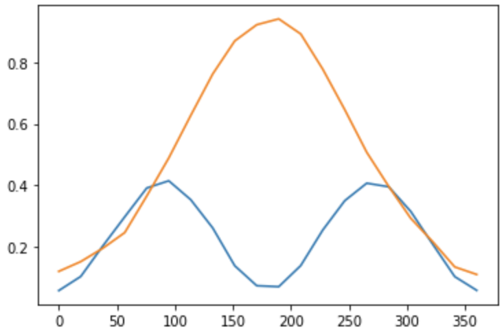

# BARBEQuE
**B**ring **A** **R**ational **B**ell **E**xperiment on **Qu**antum **E**xperience

A simple code that allows to verify, through the violation of **Bell's inequality** (in Wigner's version) that local realism is violated in quantum mechanics.

## Why “on Quantum Experience”?
It is possible to demonstrate the violation of Bell's inequality on a quantum computer, in this case on the [IBM Quantum Experience](https://quantum-computing.ibm.com) platform and in three different ways:
1. Local quantum simulation
2. Quantum simulation on IBM QE
3. Quantum computing on IBM QE

## The circuits
In order to write an algorithm in quantum computing, the concept of circuit is exploited. In this case, suppose we consider the entangled state of two spin 1/2 fermions: **the singlet state**

  

In the form of a quantum circuit, exploiting the **Hadamard-gate** and **CNOT-gate** operators for the construction of this state, we have:

  

In the **Wigner version** it is assumed to perform spin measurements with respect to 3 generic axes, in this case coplanars as in the following reference system where **c** bisects the angle between the **a** and **b** axes:

  

Carrying out the calculations it comes to the conclusion that this inequality:

  

is violated for

  

The corresponding quantum circuits are as follows:

  

Measurement of the **first qubit** along axis **a** 
Rotation of the **second qubit** of  and measure along axis **b**

  

Measurement of the **first qubit** along axis **a** 
Rotation of the **second qubit** of  and measure along axis **c**

  

Rotation of the **first qubit** of  and measure along axis **c** 
Rotation of the **second qubit** of  and measure along axis **b**

## Analysis
By plotting two functions as a function of the angle, it is possible to observe in which regions the inequality is satisfied (over 0) and in which it is violated (under 0).

1. Local quantum simulation

  

2. Quantum simulation on IBM QE

  

3. Quantum computing on IBM QE

  

