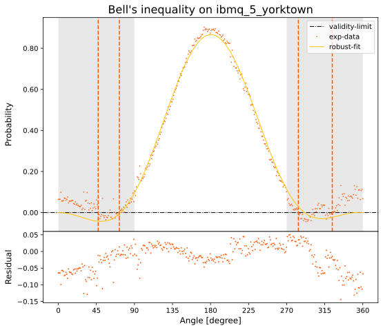

<h1 align="left">BARBEQuE</h1>

<div align="left">

[]()
[](/LICENSE)

</div>

---
<p align="left"><b>B</b>ring <b>A</b> <b>R</b>ational <b>B</b>ell <b>E</b>xperiment on <b>Qu</b>antum <b>E</b>xperience</p>
<p align="left">
    The BARBEQuE experiment is an algorithm that allows showing, through the violation of Bell's inequality (in Wigner's version), that principle of locality is violated in quantum mechanics. The algorithm is realized in Python with the use of the open-source framework Qiskit from IBM and implemented with the concept of a quantum circuit, where each logic operation is executed through proper quantum logic gates on systems of two levels (qubit).
</p>

## Table of Contents

- [About](#about)
- [Examples](#examples)
- [Getting Started](#getting_started)
- [Usage](#usage)
- [Built Using](#built_using)
- [Authors](#authors)

## About <a name = "about"></a>

The Bell's inequalities were first introduced in 1964 by the Northern Irish physicist John Stewart Bell to demonstrate that any hidden variable theories would have to satisfy certain inequalities not predicted by quantum mechanics. Since the publication of Bell's paper, numerous experiments have been carried out aimed at verifying that hidden variable theories predict a verifiable inequality relationship between the observables of the experiments. This relationship, however, appears to be in disagreement with the predictions of quantum mechanics. The purpose of this dissertation is therefore to consider and analyze a specific Bell inequality through the use of Quantum Computing and run this algorithm on IBM quantum systems. In this case, the analyzed inequality was proposed by the Hungarian physicist-mathematician Eugene Paul Wigner in the 1970s who envisages the study of an <i>entangled</i> system as a singlet state, through a projective measurement on a reference system with three coplanar axes. The result of this inequality shows that the violation in quantum mechanics is given for angles included in the interval  extended by periodicity. The BARBEQuE experiment (an acronym for Bring A Rational Bell Experiment on Quantum Experience) therefore provides for the reproduction of the Wigner demonstration using a quantum algorithm and its simulation and execution on the IBM Quantum platform to probe the potential, characterize and evaluate the current performance of quantum devices. The algorithm was created in Python using the IBM Qiskit open-source framework and implemented with the concept of a quantum circuit, in which each logical operation is performed through appropriate quantum logic gates on two-level systems (qubits). The experiment includes a first simulation phase to get an idea of the possible results, in fact the various local simulations and on IBM computers and the experiments on real quantum computers, have allowed to verify with different levels of precision the violation of Bell inequalities. The simulation involves the use of the Qiskit Aer package which allows you to simulate electronic, thermal and above all quantum noise in order to have a simulation that is as faithful as possible to the actual execution. The simulation was performed locally on a standard performance computer and on a computer with significantly higher computing power on the IBM Quantum platform. The actual quantum execution on different quantum systems, characterized by various parameters such as the Quantum Volume (QV), i.e. a protocol that evaluates the performance of a quantum system and the number of qubits involved (from 5 to 15 qubits) has shown an important difference with the simulations, but consistent with the trends predicted by inequality. A detailed analysis characterized by different configurations showed that factors such as the <i>relaxation time</i> (T1) (representing the time required for a system to pass from the excited state to the ground state through the spontaneous emission of photons), the <i>dephasing time</i> (T2) (representing the time required for both an energy loss and a phase loss to occur simultaneously), the geometric arrangement of the qubits and the physical realization of the quantum logic operators have different impact in different quantum hardware. These aspects limit its current use, the goal is to achieve the so-called <i>quantum advantage</i>, in which a quantum device can solve a problem that no classical computer can solve in a possible amount of time, such as complex problem-solving of physics and engineering or the modeling of many-body quantum systems and field theories.

## Examples <a name = "examples"></a>
In the following graph, we can analyze the results obtained in running the algorithm describing the Bell inequality on the backend <code>ibmq_athens</code>. As we can see, the inequality is violated in the 0°-90° region (in gray) extended by periodicity. However, the results show that the violation region (dashed axes) is smaller than theoretical predictions and this is due to various factors such as quantum volume (QV 32), decoherence times, qubit arrangement, etc.

<div align="center"></div>

The situation obviously becomes worse when we go to take quantum systems with lower performance than the previous one, this is the case of <code>ibmq_5_yorktown</code>. In this case, it has a smaller quantum volume (QV 8), shorter decoherence times, and a completely different geometric arrangement.

<div align="center"></div>

For a more detailed analysis, go to analyze the other graphs contained in <code>/plots/</code> or read the complete dissertation.

## Getting Started <a name = "getting_started"></a>

These instructions will get you a copy of the project up and running on your local machine for development and testing purposes.

### Installing
Open up your terminal and clone the repository locally.
```
git clone https://github.com/qismib/BARBEQuE.git
```
Setup the environment with virtualenv and Python 3.8.
```
virtualenv -p python3.8 bqenv
```
Now you can activate the environment by running the activation script.
```
source bqenv/bin/activate
```
Now you can install all the packages needed with the following line.
```
pip install -r requirements.txt
```
## Usage <a name="usage"></a>
- <b>compute.ipynb</b> allows executing Bell's experiment by choosing the quantum backend from IBM Quantum (need to set <code>YOUR_API_KEY</code>), setting the for loop with the number of qubits, the CNOT connection, the number of shots, the mode (series or parallel), and the joint probability along the three axes.
- <b>analyzer.ipynb</b> allows plotting the data stored on the previous data collections. It can be shown the fitting function, the residuals, and the RSS, in order to evaluate the performances with the QV between different quantum devices.

## Built Using <a name = "built_using"></a>

- [Qiskit](https://qiskit.org/) - Open-source SDK

## Authors <a name = "authors"></a>

- [@giachero](https://github.com/giachero) - Proposal 
- [@marcogobbo](https://github.com/marcogobbo) - Realization